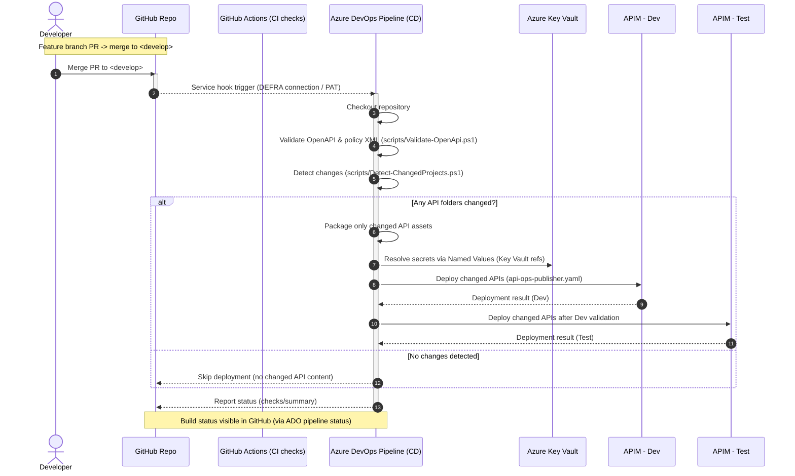
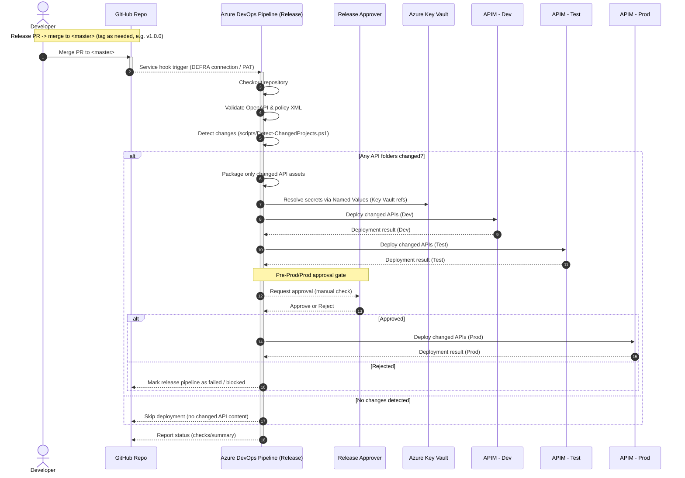
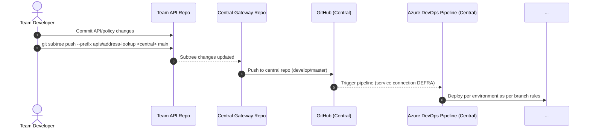

# sps-apim-gateway-address-lookup (Address Lookup v10)

> ⚠️ **This repository contains under-development code and is used for self-service development purposes.**

## Overview
This repository stores the **source-of-truth for APIM configuration** for the Address Lookup APIs (operations, versions, policies, products, and named values) and the automation required to deploy to **Dev → Test → Prod** through Azure DevOps.

It follows the Shared Platform DevOps patterns used by the team:
- **GitHub as source control** with **Azure DevOps Pipelines** as the deployment engine.
- **Branching:** feature → `develop` → `master` (release) with automated deployments.
- **Versioning:** use **tags**/releases (e.g. `v1.0.0`, `v10`) rather than encoding versions in the repo name.
- **Selective deployments:** only changed API folders are deployed to speed up CI/CD.

---

## Repository Structure
```
SPS-APIM-GATEWAY-ADDRESS-LOOKUP-V10/
├─ .github/
│  └─ workflows/                # GitHub Actions workflows (optional CI checks)
├─ external/
│  └─ base/
│     ├─ apis/                  # External-facing API definitions
│     ├─ named values/          # Named values for external APIs
│     ├─ products/              # External products configuration
│     └─ version sets/          # External API version sets
├─ internal/
│  └─ base/
│     ├─ apis/                  # Internal-facing API definitions
│     ├─ named values/          # Named values for internal APIs
│     ├─ products/              # Internal products configuration
│     └─ version sets/          # Internal API version sets
├─ LICENCE                      # Open Government Licence v3
└─ Readme.md                    # Project documentation
```

## Quick Start
1. Clone and create a feature branch:
   ```bash
   git clone <repo-url>
   cd sps-apim-gateway-address-lookup
   git checkout -b feature/<ticket-id>-short-description
   ```
2. Edit OpenAPI under `apis/address-lookup/api-definition/openapi.yaml`.
3. Update policies in `policies/`.
4. Commit and push:
   ```bash
   git add .
   git commit -m "feat(address-lookup): add /v1/addresses/search"
   git push origin feature/<ticket-id>-short-description
   ```
5. Open PR → `develop`.

## CI/CD
- **On merge to `develop`:** Deploys to Dev and Test.
- **On merge to `master`:** Deploys to all environments with approval.

### CI/CD Sequence Diagrams
#### CI/CD Flow for `develop` Branch


#### CI/CD Flow for `master` Branch


#### Git Subtree Sync Flow


## Local Validation
```powershell
pwsh ./scripts/Validate-OpenApi.ps1 -SpecPath ./apis/address-lookup/api-definition/openapi.yaml
```

## Contacts
- **Maintainer:** Prathap Mathiyalagan  
- **Manager:** David Wickett
- **Development team:** GIO Shared platform - Integration team

## License
This repository uses the [Open Governmentnalarchives.gov.uk/doc/open-government-licence/version/3.

> Contains public sector information licensed under the Open Government Licence v3.